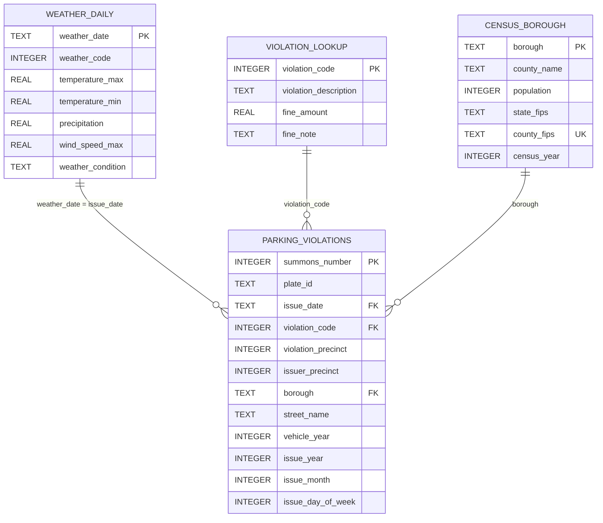

# NYC Parking Analytics Entity Relationship Diagram

The SQLite database uses one main fact table and three dimension tables.
It also exposes a read-only `parking_enriched` view that joins the fact table
to all three dimensions for rubric-ready combined analysis.

## Design Notes

- `parking_violations` is the fact table because each row represents one issued ticket.
- `weather_daily` contains one row per date. Parking records join to it through `issue_date`.
- `violation_lookup` contains one row per violation code. It prevents descriptions and fine amounts from being repeated millions of times.
- `census_borough` contains one row per NYC borough/county. It adds population context and allows ticket counts to be compared as rates.
- `summons_number` is the parking table primary key because it identifies an individual ticket.
- Foreign keys protect the relationships between parking records and the three dimensions.
- `parking_enriched` uses `LEFT JOIN` operations across all four analytical
  datasets and provides 35 columns without storing duplicate dimension values.
