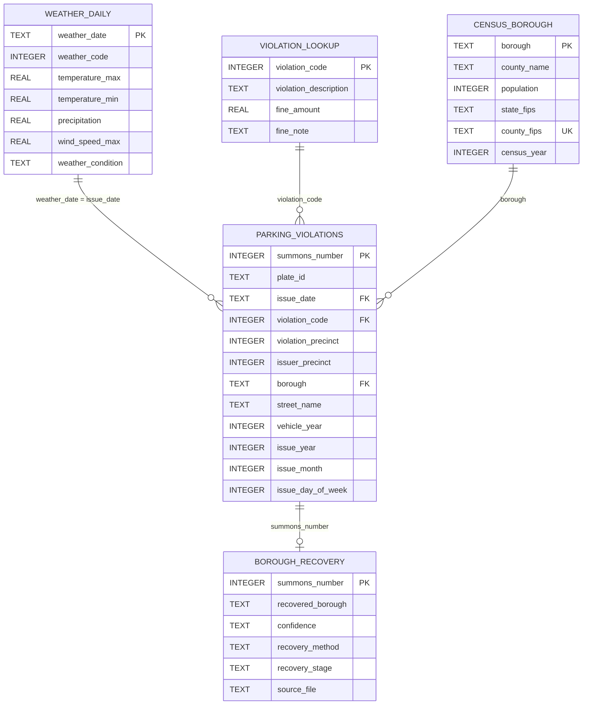

# NYC Parking Analytics Entity Relationship Diagram

The SQLite database uses one main fact table, three analytical dimension
tables, and one approved borough-recovery table. It exposes
`parking_enriched` for the original four-source join and `parking_analysis`
for final analysis with recovered boroughs.

```mermaid
erDiagram
    WEATHER_DAILY ||--o{ PARKING_VIOLATIONS : "weather_date = issue_date"
    VIOLATION_LOOKUP ||--o{ PARKING_VIOLATIONS : "violation_code"
    CENSUS_BOROUGH ||--o{ PARKING_VIOLATIONS : "borough"
    PARKING_VIOLATIONS ||--o| BOROUGH_RECOVERY : "summons_number"

    WEATHER_DAILY {
        TEXT weather_date PK
        INTEGER weather_code
        REAL temperature_max
        REAL temperature_min
        REAL precipitation
        REAL wind_speed_max
        TEXT weather_condition
    }

    VIOLATION_LOOKUP {
        INTEGER violation_code PK
        TEXT violation_description
        REAL fine_amount
        TEXT fine_note
    }

    CENSUS_BOROUGH {
        TEXT borough PK
        TEXT county_name
        INTEGER population
        TEXT state_fips
        TEXT county_fips UK
        INTEGER census_year
    }

    PARKING_VIOLATIONS {
        INTEGER summons_number PK
        TEXT plate_id
        TEXT issue_date FK
        INTEGER violation_code FK
        INTEGER violation_precinct
        INTEGER issuer_precinct
        TEXT borough FK
        TEXT street_name
        INTEGER vehicle_year
        INTEGER issue_year
        INTEGER issue_month
        INTEGER issue_day_of_week
    }

    BOROUGH_RECOVERY {
        INTEGER summons_number PK
        TEXT recovered_borough
        TEXT confidence
        TEXT recovery_method
        TEXT recovery_stage
        TEXT source_file
    }
```

## Design Notes

- `parking_violations` is the fact table because each row represents one issued ticket.
- `weather_daily` contains one row per date. Parking records join to it through `issue_date`.
- `violation_lookup` contains one row per violation code. It prevents descriptions and fine amounts from being repeated millions of times.
- `census_borough` contains one row per NYC borough/county. It adds population context and allows ticket counts to be compared as rates.
- `summons_number` is the parking table primary key because it identifies an individual ticket.
- `borough_recovery` contains at most one approved assignment per summons and
  preserves its confidence, method, stage, and evidence source.
- Foreign keys protect the relationships between parking records and the three dimensions.
- `parking_enriched` uses `LEFT JOIN` operations across all four analytical
  datasets and provides 35 columns without storing duplicate dimension values.
- `parking_analysis` keeps every parking row and selects the original borough
  first, then an approved recovered borough. `borough_source` labels each row
  as `original`, `recovered`, or `missing`.
- `borough_geosupport_audit` and `borough_description_audit` retain candidate
  evidence; `borough_unresolved` exposes the remaining review set. These audit
  objects support the workflow but are not analytical dimensions.
